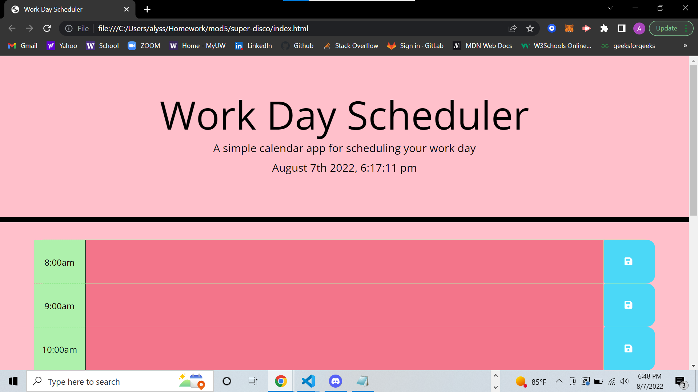

# Work Day Scheduler Starter Code

For this activity, we were asked to use started code and develope a work day scheduler that indicates the past, present and future. 

Github Repo: https://github.com/alyesp/mod5
Deployed Link: https://alyesp.github.io/mod5/

# Acceptance Criteria: 
<li> WHEN I open the planner
THEN the current day is displayed at the top of the calendar</li>
<li>WHEN I scroll down
THEN I am presented with time blocks for standard business hours</li>
<li>WHEN I view the time blocks for that day
THEN each time block is color-coded to indicate whether it is in the past, present, or future </li>
<li>WHEN I click into a time block
THEN I can enter an event</li>
<li>WHEN I click the save button for that time block
THEN the text for that event is saved in local storage</li>
<li>WHEN I refresh the page
THEN the saved events persist</li>

# Screenshot: 
